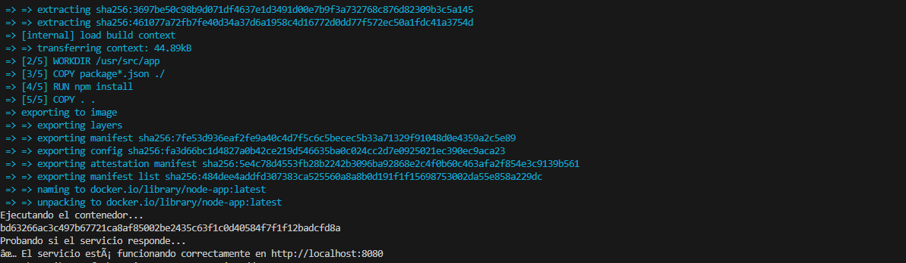

# ArquitecturaSFV-P1

# Evaluación Práctica - Ingeniería de Software V

## Información del Estudiante
- **Nombre: Jhonatan Castaño Ibarra**
- **Código: A00372798**
- **Fecha: 06/08/2025**

## Resumen de la Solución
Se desarrolló una solución completa que contiene la aplicación Node.js en un contenedor Docker. Se creó un `Dockerfile` que automatiza la construcción de la imagen y se implementó un script (PowerShell o Bash) que verifica requisitos, ejecuta el contenedor, prueba el servicio, e informa el estado. También se documentó el proceso siguiendo principios DevOps.

## Dockerfile
El `Dockerfile` se diseñó con base en buenas prácticas:
- Se utilizó `node:18` como imagen base por ser estable y ampliamente soportada.
- Se definió un `WORKDIR` para mantener una estructura organizada dentro del contenedor.
- Se copiaron primero los archivos `package*.json` para aprovechar la cache en la instalación de dependencias.
- Se expuso el puerto 8080 según las especificaciones del entorno.
- Se definió el comando `CMD` para ejecutar directamente la aplicación.

## Script de Automatización
El script automatiza el proceso completo:
- Verifica si Docker está instalado y disponible.
- Construye la imagen usando el `Dockerfile`.
- Ejecuta un contenedor con variables de entorno (`PORT=8080`, `NODE_ENV=production`).
- Espera unos segundos para asegurar que el servicio está activo.
- Realiza una prueba HTTP al endpoint principal con `curl` o `Invoke-WebRequest`.
- Imprime en consola el resultado de la prueba y el estado general del despliegue.

## Principios DevOps Aplicados
1. **Automatización**: Se automatiza el despliegue y validación del servicio mediante scripts.
2. **Contenerización**: La aplicación se ejecuta en un contenedor para garantizar portabilidad y consistencia.
3. **Verificación Continua**: Se implementa una prueba básica para asegurar que el servicio responde correctamente luego del despliegue.

## Captura de Pantalla


## Mejoras Futuras
1. Agregar un archivo `docker-compose.yml` para gestionar múltiples servicios si la arquitectura crece.
2. Incluir pruebas unitarias automáticas que se ejecuten antes del build y despliegue.
3. Añadir logs más detallados para facilitar debugging y monitoreo.

## Instrucciones para Ejecutar

### Opción 1: Usando PowerShell
```powershell
# Navega al directorio del proyecto
cd path\to\project

# Ejecuta el script de automatización
.\deploy.ps1
